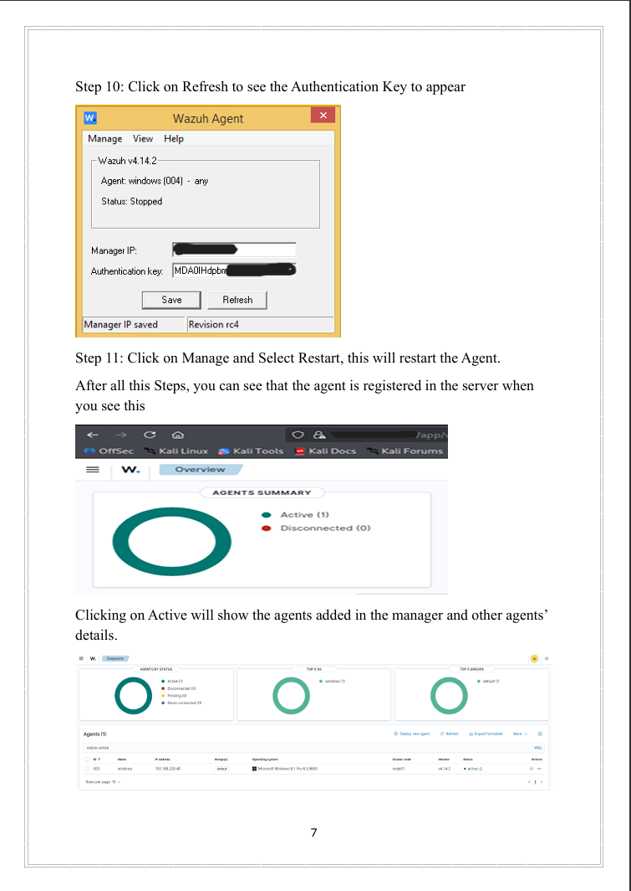
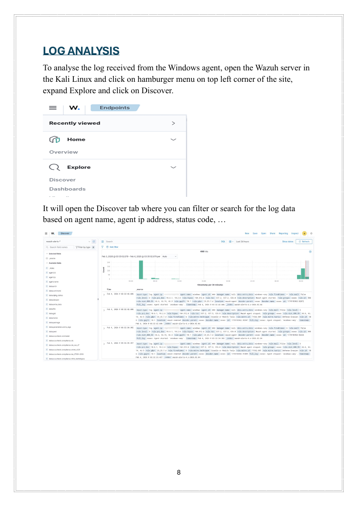

# Wazuh SIEM Log Monitoring Lab

This project demonstrates the implementation of a Security Information and Event Management (SIEM) environment using Wazuh for centralized log monitoring and security analysis.

## Project Overview

The objective of this project was to deploy and configure a Wazuh SIEM environment and monitor endpoint logs in a lab setup.

The Wazuh server was installed on Kali Linux and a Windows endpoint was configured with the Wazuh agent to forward system logs to the server. These logs were then monitored and analyzed through the Wazuh dashboard.

## Tools and Technologies

- Wazuh SIEM
- Kali Linux
- Windows 8.1
- VirtualBox

## Architecture

Wazuh Manager (Kali Linux)  
↓  
Wazuh Agent (Windows Endpoint)  
↓  
Centralized Log Collection  
↓  
Security Event Monitoring and Analysis

## Implementation Steps

1. Installed Wazuh server components (Manager, Indexer, Dashboard) on Kali Linux.
2. Configured firewall rules to allow agent communication.
3. Installed the Wazuh agent on a Windows endpoint.
4. Authenticated the agent with the Wazuh manager.
5. Verified successful agent registration in the dashboard.
6. Analyzed logs using the Discover tab in Wazuh.

## Screenshots

### Agent Registration

### Log Analysis

## Results

The Wazuh SIEM setup successfully collected logs from the Windows endpoint and displayed them on the dashboard, enabling centralized monitoring and analysis of security events.

## Author

Mohammed Fahad P H
